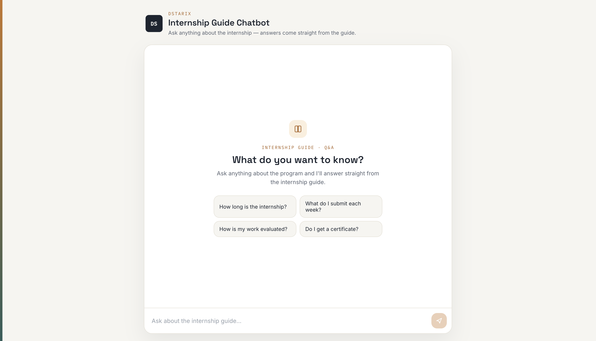
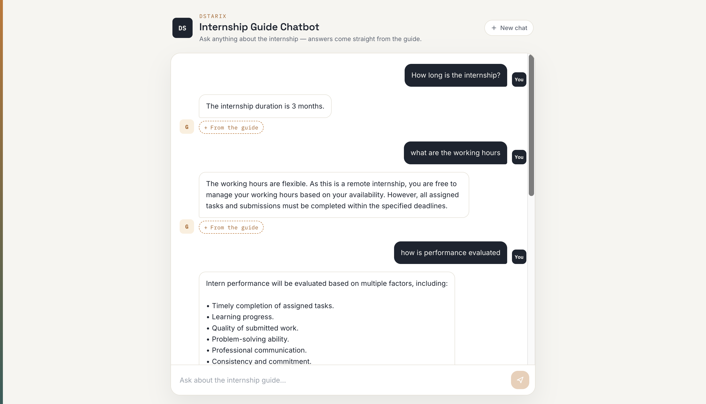

# 📚 AI Internship Guide Chatbot

An AI-powered chatbot that answers internship-related queries by retrieving information directly from an internship guide PDF using **Retrieval-Augmented Generation (RAG)**.

Instead of relying solely on the LLM's knowledge, the chatbot searches the provided document using semantic search (FAISS) and generates accurate, context-aware responses with Google Gemini.

---

## Features

- AI-powered question answering using Google Gemini
- PDF-based knowledge retrieval with RAG
- Semantic search using FAISS Vector Database
- Interactive chat interface built with React
- Flask REST API backend
- LangChain-powered retrieval pipeline
- Responsive and minimal user interface
- Prevents hallucinations by answering only from the provided document

---

## Tech Stack

### Frontend
- React
- Vite
- Axios
- CSS

### Backend
- Flask
- LangChain
- Google Gemini API
- FAISS
- PyPDF
- Python

---

## Project Structure

```
AI-Internship-Guide-Chatbot/
│
├── backend/
│   ├── app.py
│   ├── config.py
│   ├── requirements.txt
│   ├── services/
│   │   ├── gemini_service.py
│   │   └── vector_service.py
│   │
│   ├── knowledge/
│   │   └── documents/
│   │       └── Internship_Rule_Book.pdf
│   │
│   ├── vectorstore/
│   └── .env
│
├── frontend/
│   ├── src/
│   ├── public/
│   └── package.json
│
└── README.md
```

---

## How It Works

1. The internship guide PDF is loaded.
2. The document is split into smaller chunks.
3. Each chunk is converted into embeddings using Google's embedding model.
4. The embeddings are stored in a FAISS vector database.
5. When the user asks a question:
   - Relevant document chunks are retrieved.
   - Retrieved context is sent to Gemini.
   - Gemini generates an answer strictly based on the retrieved context.
6. The response is displayed in the React chat interface.

---

## 📥 Installation

### Clone the repository

```bash
git clone https://github.com/Shreyaakatiyar/AI_Internship_Guide_Chatbot.git

cd AI-Internship-Guide-Chatbot
```

---

### Backend Setup

```bash
cd backend

python -m venv venv
```

Activate the virtual environment.

Windows

```bash
venv\Scripts\activate
```

Mac/Linux

```bash
source venv/bin/activate
```

Install dependencies

```bash
pip install -r requirements.txt
```

Create a `.env` file

```env
GEMINI_API_KEY=YOUR_API_KEY
```

Generate the vector database (first time only)

```bash
python vector_service.py
```

Run the backend

```bash
python app.py
```

Backend runs at

```
http://127.0.0.1:5000
```

---

### Frontend Setup

```bash
cd frontend

npm install

npm run dev
```

Frontend runs at

```
http://localhost:5173
```

---

## Example Questions

- How long is the internship?
- What are the working hours?
- Do interns receive a certificate?
- How is performance evaluated?
- What are the submission guidelines?
- Can I use AI tools during the internship?

---

## Screenshots

### Home





### Chat Interface





---

## Environment Variables

Create a `.env` file inside the backend folder.

```env
GEMINI_API_KEY=YOUR_API_KEY
```

---

## 👩‍💻 Author

**Shreyaa Katiyar**

If you found this project helpful, consider giving it a ⭐ on GitHub.